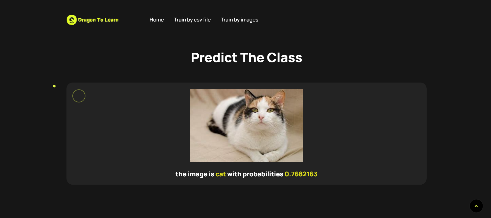

# Dragone to Learn by JADIR Mohammed
## Neural network training web app with Flask and TensorFlow

This application In-depth study and automation of the use of TensorFlow for training neural networks.

## Features

This phase consists of an in-depth study of the use of TensorFlow to automate the training processes of neural networks, building on the knowledge gained during the last lab session as well as various external resources. The project also aims to develop a complete web application, with an intuitive frontend using HTML, CSS, JavaScript, and Bootstrap, while the backend will be managed with Flask. The role of Flask is to handle the user interface and coordinate the training of neural network models using TensorFlow. This automation will enable users to easily interact with the application to configure and train models smoothly and efficiently.

[](https://python.org)


### Screenshots

**Home Page:**


**Training page by csv file:**


**Training page by images:**


**Results 1:**


**image prediction page:**




## Running the Project Locally

First, clone the repository to your local machine:

```bash
git clone https://github.com/Jadir99/Neural-network-training-web-application-with-Flask-and-TensorFlow.git
```

Install the requirements:

```bash
pip install -r requirement.txt
```


Finally, run the development server:

```bash
python app.py
```

The project will be available at **127.0.0.1:4000**.


